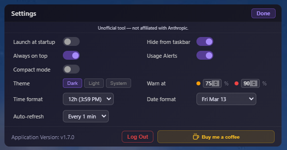

# Claude Usage Widget

A beautiful, standalone desktop widget for **Windows, macOS, and Linux** that displays your Claude.ai usage statistics in real-time.


---

## Features

🎯 **Real-time Usage Tracking** — Monitor both session and weekly usage limits
📊 **Visual Progress Bars** — Clean, gradient progress indicators with configurable warning thresholds
⏱️ **Countdown Timers** — Circular timers showing time elapsed in the current session window
🔄 **Auto-refresh** — Updates every 5 minutes automatically
📈 **Usage History Graph** — Toggleable 7-day chart showing session and weekly trends over time
🎨 **Modern UI** — Sleek, draggable widget with dark and light themes
🔒 **Secure** — Encrypted credential storage
📍 **Always on Top** — User-controlled, stays visible across all workspaces
💾 **System Tray** — Minimizes to tray for easy access
⚙️ **Settings Panel** — Persistent preferences for startup, theme, tray, thresholds, and date/time formats
🔔 **Update Notifications** — Automatic check for new releases on startup
🕐 **Configurable Date & Time Formats** — 12h/24h time, and flexible weekly reset date display

---

## What's New

### v1.7.0

#### 📈 Usage History Graph
A toggleable usage history graph now sits below the main widget. Click the graph button (↗) in the toolbar to show or hide it.


- Displays up to **7 days** of session and weekly usage history
- History is **persisted across restarts** via electron-store — no need to keep the app running continuously
- Sonnet and Extra Usage lines appear automatically when those sections are visible
- Lines with no data are hidden to keep the chart clean
- **Adaptive x-axis labels** — shows times for short spans, weekday+hour for medium spans, and dates for longer spans
- Respects your **12h/24h time format** setting
- Hover tooltip shows exact timestamp and value
- Graph button highlights in theme color when active

#### 🌍 Currency Support
The Extra Usage row now displays the correct currency symbol based on your account's billing currency — **€**, **£**, or **$**. Falls back to the ISO code for any other currency.

#### 🐛 Bug Fixes
- Fixed widget showing "No Usage Yet" between session windows even when weekly data was present
- Fixed app crash when a usage alert fired (missing `Notification` import)
- Fixed macOS minimize button — widget now minimizes to Dock instead of vanishing, and restores correctly when clicking the Dock icon
- Increased widget width to prevent date/time text clipping on macOS

---

### v1.5.3

#### 🔔 Improved Update Notifications
The widget now checks for new releases more frequently for users who keep the app running long-term:

- **On session reset** — an update check runs automatically each time your 5-hour session window resets
- **Every 24 hours** — a background check runs once daily as a fallback

Previously the widget only checked for updates at startup.

---

### v1.5.2

#### 🐧 Linux Support
The widget now builds and runs natively on Linux. Pre-built **AppImage** packages are available for x64 and arm64 — no installation required, just download, make executable, and run.

- Tested on Zorin OS (Ubuntu-based); compatible with most modern Linux distributions
- System tray integration via X11/XDG
- Note: **Launch at startup** is not yet supported on Linux (Electron limitation)

---

### v1.5.1

#### 💡 Extra Usage Status Indicator
The Extra Usage row now shows an **ON** or **OFF** badge indicating whether extra usage is currently enabled on your account. When off, the bar correctly shows 0% and the badge is grey. When on, the badge is green alongside your spend and balance data.

---

### v1.5.0

#### 🔔 Update Notifications
The widget now checks for new releases automatically at startup. When a newer version is available, a dismissible banner appears below the title bar with a direct link to the releases page. The current version is also shown in the Settings panel, with an update link when applicable.

#### 🕐 Configurable Date & Time Formats
Two new settings in the Settings panel give you control over how reset times are displayed:

**Time format** — controls the session "Resets At" column and any time shown in the weekly format:
- `12h` — e.g. `3:59 PM` (default)
- `24h` — e.g. `15:59`

**Date format** — controls the weekly "Resets At" column:
- `Mar 13` (default)
- `Fri Mar 13`
- `Fri Mar 13 + time` — combines date with your chosen time format

#### 🐛 Bug Fixes & UI Improvements
- Fixed Extra Usage row alignment to match the main widget grid
- Update banner correctly expands and contracts the widget height when shown or dismissed
- Settings panel height increased to accommodate new format options

---

### Settings Panel

A full settings overlay with persistent preferences via electron-store.



- ⚙️ **Launch at startup** — Auto-start with Windows or macOS login
- 🖥️ **Always on top** — Now user-controlled (was previously hardcoded on)
- 📌 **Hide from taskbar** — Tray-only mode
- 🎨 **Theme selector** — Dark / Light / System
- ⚠️ **Warning thresholds** — Configurable amber and red levels for usage bars
- 🕐 **Time format** — 12h or 24h
- 📅 **Date format** — Controls how the weekly reset date is displayed

### Improved Main Widget Layout

- 5-column grid with labeled headers: Session Used / Elapsed / Resets In / Resets At
- Elapsed column shows a circular timer of how far through the current window you are
- Resets In shows the countdown separately so it's not confused with elapsed time
- Resets At shows the actual local clock time (session) or date (weekly reset)
- Fresh-user state shows "Not started" instead of ambiguous dashes when no session is active

### Quality of Life

- 🔵 Rounded corners matching system window style
- 🖼️ Tray icon uses the app logo instead of the default Electron robot icon


### macOS Support

- Native macOS build with proper `.icns` icon
- Dock and menu bar tray integration
- Auto-start on login via macOS Login Items

---

## Installation

### Download Pre-built Release

**Windows:**
1. Download the latest `Claude-Usage-Widget-{version}-win-Setup.exe` (installer) or `Claude-Usage-Widget-{version}-win-portable.exe` (no install needed) from [Releases](../../releases)
2. Run the installer or portable exe
3. Launch "Claude Usage Widget" from the Start Menu (installer) or directly (portable)

**macOS:**
1. Download the latest `Claude-Usage-Widget-{version}-macOS-arm64.dmg` (Apple Silicon) or `Claude-Usage-Widget-{version}-macOS-x64.dmg` (Intel) from [Releases](../../releases)
2. Open the DMG and drag the app to your Applications folder
3. Launch "Claude Usage Widget" from Applications

> **⚠️ macOS Security Notice:** Because this app is not yet notarized with Apple, macOS Gatekeeper may show a "damaged or can't be opened" warning. To fix this, run the following command in Terminal after installing:
> ```
> xattr -cr /Applications/Claude\ Usage\ Widget.app
> ```
> Then try launching the app again.

**Linux:**
1. Download the latest `Claude-Usage-Widget-{version}-linux-x86_64.AppImage` (Intel/AMD) or `Claude-Usage-Widget-{version}-linux-arm64.AppImage` (ARM) from [Releases](../../releases)
2. Make it executable: `chmod +x Claude-Usage-Widget-*.AppImage`
3. Run it: `./Claude-Usage-Widget-*.AppImage`

> **Note:** AppImage runs without installation on most Linux distributions. On Ubuntu 22.04+, you may need to install a dependency first:
> ```bash
> sudo apt install libfuse2
> ```
> If your distro uses AppArmor or similar sandboxing, you may also need to pass `--no-sandbox` on first run.

---

### Build from Source

**Prerequisites:**
- Node.js 18+ ([Download](https://nodejs.org))
- npm (comes with Node.js)

```bash
# Clone the repository
git clone https://github.com/SlavomirDurej/claude-usage-widget.git
cd claude-usage-widget

# Install dependencies
npm install

# Run in development mode
npm start

# Build for Windows
npm run build:win

# Build for macOS (must be run on a Mac)
npm run build:mac

# Build for Linux
npm run build:linux
```

The installer will be created in the `dist/` folder.

---

## Usage

### First Launch

1. Launch the widget
2. Click "Login to Claude" when prompted
3. A browser window will open — log in to your Claude.ai account
4. The widget will automatically capture your session
5. Usage data will start displaying immediately

### Widget Controls

- **Drag** — Click and drag the title bar to move the widget
- **Refresh** — Click the refresh icon to update data immediately
- **Minimize** — Click the minus icon to hide to system tray / dock
- **Close** — Click the X to minimize to tray (doesn't exit)

### System Tray Menu

Right-click the tray icon for:
- Show/Hide widget
- Refresh usage data
- Re-login (if session expires)
- Settings
- Exit application

---

## Understanding the Display

### Current Session

| Column | Description |
|--------|-------------|
| Session Used | Progress bar showing usage from 0–100% |
| Elapsed | Circular timer showing how far through the 5-hour window you are |
| Resets In | Countdown until the session window resets |
| Resets At | Actual local clock time when the session resets |

**Color Coding:**
- 🟣 Purple: Normal usage (below warning threshold, default 75%)
- 🟠 Orange: High usage (above warning threshold)
- 🔴 Red: Critical usage (above danger threshold, default 90%)

### Weekly Limit

Same layout and color coding as Current Session, tracking your 7-day usage window. Resets At shows the date of the weekly reset.

---

## Configuration

### Auto-start on Boot

Enable the **Launch at startup** toggle in the Settings panel (⚙️ icon in the title bar). Works on Windows and macOS. Not currently supported on Linux.

### Custom Refresh Interval

Edit `src/renderer/app.js`:

```javascript
const UPDATE_INTERVAL = 5 * 60 * 1000; // Change to your preference (in milliseconds)
```

---

## Troubleshooting

**"Login Required" keeps appearing**
- Your Claude.ai session may have expired
- Click "Login to Claude" to re-authenticate
- Check that you're logging into the correct account

**Widget not updating**
- Check your internet connection
- Click the refresh button manually
- Ensure Claude.ai is accessible in your region
- Try re-logging in from the system tray menu

**Widget position not saving**
- Window position is saved automatically when you drag it
- Position will be restored when you restart the app

**Build errors**

If you encounter errors during `npm install` or `npm start`, a clean reinstall resolves most issues caused by stale or corrupted dependencies:

```bash
# Remove existing dependencies and lock file, then reinstall clean
rm -rf node_modules package-lock.json
npm install
```

If you're still hitting errors after a clean install, please open a discussion in the [Support](../../discussions/categories/support) category with your OS version, Node.js version (`node --version`), and the full error output.

---

## Privacy & Security

- Your session credentials are stored **locally only** using encrypted storage
- No data is sent to any third-party servers
- The widget only communicates with the Claude.ai official API
- Session cookies are stored using Electron's secure storage
- Logout completely removes the session key from encrypted storage, clears all Claude.ai cookies, and wipes Electron session storage so nothing lingers on shared machines

### Session Key Storage Details

| Location | Purpose | Cleared on logout? |
|----------|---------|-------------------|
| Windows: `%APPDATA%/claude-usage-widget/config.json` (encrypted via electron-store) | Persists credentials between app restarts | Yes |
| macOS: `~/Library/Application Support/claude-usage-widget/config.json` (encrypted via electron-store) | Persists credentials between app restarts | Yes |
| Electron in-memory session cookie (`.claude.ai` domain, secure, httpOnly) | Used by hidden BrowserWindow for API requests | Yes |

The encryption key is embedded in the application. This protects against casual file inspection but not against a determined attacker with access to the source code. For shared machines, always log out when finished.

---

## Technical Details

**Built with:**
- Electron 28.0.0
- Pure JavaScript (no framework overhead)
- Native Node.js APIs
- electron-store for secure storage

**API Endpoint:** `https://claude.ai/api/organizations/{org_id}/usage`

**Debug Mode:**

```bash
# Via flag
electron . --debug

# Via env var
DEBUG_LOG=1 npm start
```

---

## Roadmap

- [x] macOS support
- [x] Settings panel
- [x] Remember window position
- [x] Custom warning thresholds
- [x] Configurable date & time formats
- [x] Update notifications
- [x] Linux support
- [ ] Usage history graphs
- [ ] Compact mode
- [ ] Notification alerts at usage thresholds
- [ ] Multiple account support
- [ ] Keyboard shortcuts

---

## Contributing

Contributions are welcome! Please feel free to submit a Pull Request. For feature requests and discussions, visit the [Discussions](../../discussions) tab.

---

## License

MIT License — feel free to use and modify as needed.

---

## Disclaimer

This is an unofficial tool and is not affiliated with or endorsed by Anthropic. Use at your own discretion.

---

## Support

- **Questions & help** — visit the [Support](../../discussions/categories/support) category in Discussions
- **Feature requests** — post in [Feature Requests](../../discussions/categories/feature-requests)
- **Bug reports** — open a new [Issue](../../issues) with your OS version, Node.js version, and any error messages

---

Made with ❤️ for the Claude.ai community
